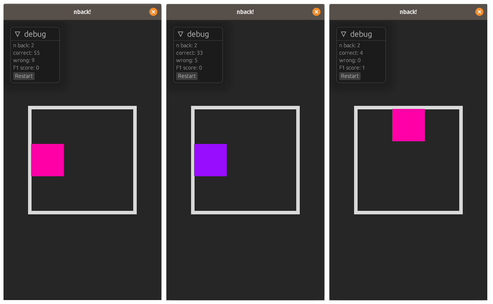

# Bevy-N-Back

An infinite run of Dual-n-Back on [Bevy engine][bevy].

## How to run the game

- Start the native app: `cargo run --features native`
- Start the web build: `cargo make serve` (requires `cargo-make`; to install run `cargo install cargo-make`)

You should keep the `credits` directory up to date. The release workflow automatically includes the directory in every build.

## GitHub workflow

- workflow for GitHub actions creating releases for Windows, Linux, macOS and Web (WASM) ready for distribution
  - push a tag in the form of `v[0-9]+.[0-9]+.[0-9]+*` (e.g. `v1.1.42`) to trigger the flow

### Updating the icons

1. Replace `build/windows/icon.ico` (icon used for windows executable and as favicon for the web-builds)
2. Replace `build/macos/icon_1024x1024.png` with a `1024` times `1024` pixel png icon and run `create_icns.sh` (make sure to run the script inside the `macos` directory) - _Warning: sadly this seems to require a mac..._

## Known issues

- Audio in web-builds might sound bad in some browsers. See [bevy_kira_audio/#9][firefox-sound-issue] for more information.

## License

This program is free software: you can redistribute it and/or modify it under the terms of the GNU General Public License as published by the Free Software Foundation, either version 3 of the License, or (at your option) any later version. This program is distributed in the hope that it will be useful, but WITHOUT ANY WARRANTY; without even the implied warranty of MERCHANTABILITY or FITNESS FOR A PARTICULAR PURPOSE. See the GNU General Public License for more details. You should have received a copy of the GNU General Public License along with this program. If not, see <https://www.gnu.org/licenses/>.

[bevy]: https://bevyengine.org/
[bevy-learn]: https://bevyengine.org/learn/
[bevy-discord]: https://discord.gg/bevy
[nikl-twitter]: https://twitter.com/nikl_me
[firefox-sound-issue]: https://github.com/NiklasEi/bevy_kira_audio/issues/9
